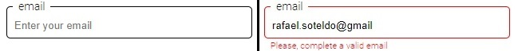
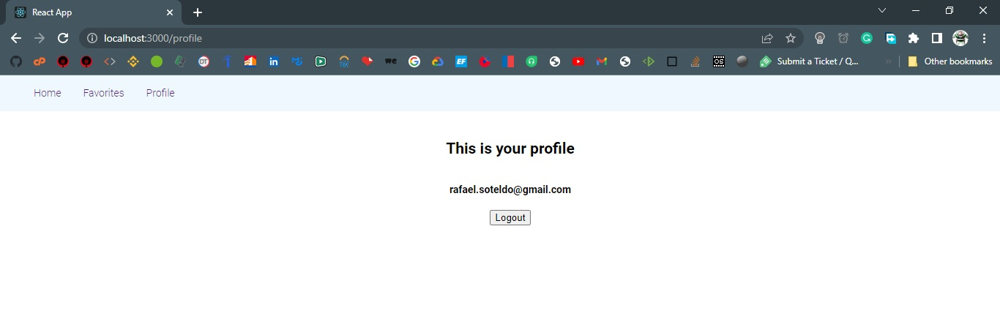

[](https://github.com/rafaelsoteldosilva/marvel-front/blob/main/README.md)

# **Marvel**

<p align="center">
  <a href="http://google.com.au/" rel="some text">
     
  </a>
</p>

Esta app consume la API de marvel y permite a los usuarios seleccionar sus comics favoritos de Marvel

Sus principales tecnologías son:

-  React,
-  React-Redux,
-  Styled-Components,
-  React Router DOM,
-  Axios.

## **Guía de Instalación**

-  GIT Clone el repositorio en su disco duro
-  Vaya al directorio creado con cd, y ejecute `npm install` el cual instalará todas las dependencias necesarias
-  Obtenga una APIKEY y una HASH en el portal de Marvel para desarrolladores. Subscríbase y siga las instrucciones

<p align="center">
  
</p>

-  Cree un archivo `.env` en el directorio raiz, coloque allí los valores obtenidos

```
MARVEL_APIKEY=<su clave api>
MARVEL_HASH=<su número hash>
```

Estos valores serán usados en la función `getAllComics` en `src/redux/actions/comicsActions.js`

-  Run marvel-server, in order to have the server listening to the port 3001
-  Run the app with `npm start`

## **El Proyecto**

El directorio principal es `src`, el cual contiene la mayoría de los componentes que construyen la app

Los archivos serán explicados en el orden en el que aparecen en el proyecto en `VS Code`

La página por default es `Home.js`, la cual hace un `useEffect []` que busca la información de los comics de la API de Marvel, y la coloca en el estado de `Redux`

Los favoritos serán cargados desde Mongo DB (ver `Marvel Server`) cuando el usuario hace `login`

El presente documento resaltará las caracterísitcas más importantes del código de la app, dejando fuera los detalles.

## **The src folder**

Los sub-directoios son:

-  **components**
-  **globals**
-  **pages**
-  **redux**

## **components**

### - **<ins>/src/components/ComicCard.js</ins>**

<p align="center">
  
</p>

Este componente es usado por `Home.js` y `Favorites` para mostrar los cards comics en una rejilla, ya sean los comics de la API o los favoritos:

```jsx
// src/pages/Home.js
comics.map((comicInfo, ndx) => {
   return (
      <ComicCard
         callFromFavorites={false}
         comicObject={comicInfo}
         index={ndx}
      />
   );
});
```

```jsx
// src/pages/Favorites.js
favoriteComics.map((comicInfo, ndx) => {
   return (
      <ComicCard callFromFavorites={true} comicObject={comicInfo} index={ndx} />
   );
});
```

```jsx
// src/components/ComicCard.js
// It receives the comicObject of the clicked comic, and looks over favoritesComics for this particular object
...
   const isfavorite = (favoriteComics, comicObject) => {
      let isFavorite = false;
      if (favoriteComics.length > 0) {
         isFavorite = favoriteComics.some(
            (favoriteComic) =>
               parseInt(favoriteComic.comicId) === comicObject.comicId
         );
      }
      return isFavorite;
   };

...


// The icon is shown depending on the procedure `isFavorite`
...
user && !callFromFavorites && (
   <ShowIcon
      heartIsRed={isFavorite(favoriteComics, comicObject)}
      isFavorite={callFromFavorites}
      icon={
         callFromFavorites
            ? faHeartCrack
            : isFavorite(favoriteComics, comicObject)
            ? solidHeart
            : regularHeart
      }
      onClick={(e) => handleHeartClick(comicObject, e)}
   />
);
...
```

Si el/la usuario hace click en un corazón hueco, el comic es añadido a la lista de favoritos, y se cambia a corazón sólido

<p align="center">
  
</p>

Si el/la usuario hace click en un corazón sólido, el comic es eliminado de la lista de favoritos, y se cambia a corazón hueco

Si la llamada a este componente se hace desde `Favoritos.js`, se muestra un corazón roto, el cual sirve para eliminar el comic de la lista de favoritos

<p align="center">
  
</p>

### - **<ins>/src/components/LoginSignUp.js</ins>**

<p align="center">
  
</p>

Este componente es usado cuando el/la usuario selecciona, del menu bar, login o signup,

Esto se aprecia en `App.js`:

```jsx
// App.js
<Route
   path="/signup"
   element={<LoginSignUp isSignUp={true} />}
/>
<Route
   path="/login"
   element={<LoginSignUp isSignUp={false} />}
/>
```

```jsx
// src/components/LoginSignUp.js
import { useAuth } from "../globals/auth";

...

const auth = useAuth();

...
   useEffect(() => {
      const res = axios
         .get("http://localhost:3001/v1/users/getAllusers")
         .then((res) => {
            auth.loadUsers(res.data);
         });
   }, []);
```

Esto ejecutará el endpoint:

```jsx
// marvel-server/routes/usersRoutes.js
router.route("/getAllUsers").get(UserEndpoints.getAllUsers);
```

Este request lee todos los usuarios ya registrados en la base de datos Mongo DB

Contiene una forma controlada que obtiene el email y el password, el botón `login` (el cual puede ser `Sign Up` cuando `isSignUp` es `true`) es activado una vez que ambos campos sean llenados con valores correctos

### - **Algunos detalles internos de la forma**

El valor correcto para un email es una dirección correcta de email, y para el password, es al menos 8 caracteres de largo, al menos un número y una letra del alfabeto.

La forma valida sus acmpos usando las siguientes `regular expressions`:

```jsx
const emailRE = /^[a-zA-Z0-9_.+-]+@[a-zA-Z0-9-]+\.[a-zA-Z0-9-.]+$/u;
const passwordRE = /^(?=.*[A-Za-z])(?=.*\d)[A-Za-z\d]{8,}$/u;
```

La forma también usa un arreglo `touched`, el cual sirve para indicar si un campo tiene un valor o nó.

### - **definiendo un campo en la forma**

Este es un `inputField`:



Defino cada uno como:

```jsx
// src/components/LoginSignUp.js
<FieldContainer>
   <InputField
      error={touched[email] && errorMessagesRefValues.current.email !== ""}
   >
      <legend>email</legend>
      <Input
         type="text"
         name={email}
         size="50"
         placeholder="Enter your email"
         value={formValues.email}
         onChange={handleInputChange}
      />
   </InputField>
   <FieldErrorText>
      {touched[email] && errorMessagesRefValues.current.email}
   </FieldErrorText>
</FieldContainer>
```

Note que especifico la legenda y el input de cada campo, estos elementos son estilizados como:

```jsx
// src/components/LoginSignUp.js
const FieldContainer = styled.div``;

// An inputField is defined upon the fieldset
// I then overwrite the style of the fieldset
//    border: (making it red when there's an error)
//    legend
//    Input: making it wide enough, disabling the border, disabling it's outline when focused
// among other things

// The input inside this fieldset is a regular input

// The reason I decided to "inherit" from fieldset and not input was to get the appearance of a fieldset, which
// is more compact

// FieldErrorText is the red text that appears bellow an input field when there's an error

// EXAMPLE
const InputField = styled.fieldset`
   border: 1px solid ${({ error }) => (error ? "red" : "black")};
   border-radius: 5px;
   padding: 0.5em;
   margin: 0 0;
   width: 22em;

   legend {
      padding: 0 7px;
      color: black;
   }

   Input {
      color: black;
      border: none;
      width: 100%;
      :focus {
         outline: none;
      }
   }
`;

const Input = styled.input``;

const FieldErrorText = styled.label`
   margin: 0.7em;
   padding: 0;
   color: red;
   font-size: 0.8em;
`;
```

Declaré el arreglo de mensajes de error como un arreglo de referencias `ref`, de forma que se actualice inmediatamente al ser seteado, y no asincrónicamente como cualquier variable de estado, de esta form los mensajes de error siempre están actualizados. Declaro también un estado de mentira `forceRender`, que seteo cada vez que se cambia el arreglo de mensajes de error, de forma que se fuerza un `render` del componente.

Note que un campo vacío no es un error, sólo setea el valor correspondiente touched a `false`, haciendo que el botón `login/sign up` esté deshabilitado

### - **Enabling or disabling the Login/Sign Up button**

```jsx
// src/components/LoginSignUp.js
useEffect(
   () => {
      let fieldValidations = [];
      // get an array of all the values of the fields that are not empty and correctly filled
      Object.keys(touched).forEach((field) => {
         fieldValidations.push({ field, valid: validateField(field) });
      });

      // check if a required field has an incorrect value
      setDisableSendButton(
         fieldValidations.some((fieldValidations) => {
            return (
               requiredFields[fieldValidations.field] && !fieldValidations.valid
            );
         })
      );
   },
   // eslint-disable-next-line react-hooks/exhaustive-deps
   [formValues]
);
```

Si alguno de los valores de la forma cambia se ejecuta el anterior código. Entonces, si alguno de los campos tiene un valor incorrecto, el botón es deshabilitado, y si en cambio todos los campos son correctos, el botón es habilitado, seteando `disableSendButton` en `false`

La forma de hacer al botón habilitado o deshabilitado es asociando el valor de la variable de estado `disableSendButton` a la propiedad `disabled` del botón.

```jsx
// src/components/LoginSignUp.js
<ThisButton disabled={disableSendButton} onClick={performOk}>
   {isSignUp ? "SIGN UP" : "LOG IN"}
</ThisButton>
```

El `styled component` `<ThisButton />` es derivado de `globalStyles.Button`:

```jsx
// src/components/LoginSignUp.js
const ThisButton = styled(globalStyles.Button)`
   margin-top: 10px;
   width: 60px;
`;
```

Y `globalStyles.Button` es:

```jsx
// globalStyles.js
// if the disable argument is true, then the button is disabled
export const Button = styled.button`
   ${({ disabled }) =>
      disabled &&
      `
            disabled
        `}
...
```

### **PerformOk**

Este procedimiento chequea si el usuario está registrado o nó, y si no, sugiere al usuario que se registre.

Si el usuario esta registrado, chequea que el pasword indicado sea igual al guardado en la base de datos.

```jsx
// src/components/LoginSignUp.js
...
const LoginSignUp = ({ isSignUp, getAllFavoriteComicsLocal }) => {
   const auth = useAuth();
   const navigate = useNavigate();

...

const performOk = () => {
   if (isSignUp) {
      if (auth.isARegisteredUser(formValues.email)) {
         alert(
            `${formValues.email} ya es un usuario registrado, por favor, haga LogIn`
         );
         navigate("/");
      } else {
         createUser({
            email: formValues.email,
            password: formValues.password,
         });
         navigate("/");
      }
   } else {
      if (auth.checkUserPassword(formValues.email, formValues.password)) {
         auth.login(formValues.email);

         navigate("/");
      } else {
         alert(
            `${formValues.email} no está registrado o no coindide el password`
         );
         navigate("/");
      }
   }
   navigate("/");
};
```

### - **<ins>/src/components/NavBar.js</ins>**

Está a cargo de mostrar el menú principal de navegación.

Cuando no hay un usuario logeado, las opciones son sólo Home, Login y Sign Up

Cuando hay un usuario logeado, las opciones son Home, Logout, Favorites, y Profile

La forma como muestro o no algunas opciones es usando argumentos en los styled components, por ejemplo este es un elemento que sólo se muestra si el usuario está logeado:

```jsx
// src/components/NavBar.js
export const NavElementShowWhenLoggedIn = styled(NavLink)`
   ${NavItem}
   display: ${({ logged }) => (logged ? "inline" : "none")};
`;
```

`${NavItem}` son las opciones por defecto de cualquier menu item:

```jsx
// src/components/NavBar.js
const NavItem = css`
   margin-left: 1em;
   cursor: pointer;
   text-decoration: none;
`;
```

Ahora, para las opciones de display, pregunto por `isLoggedIn`, el cual dice si el usuario está logeado o no.

```jsx
// src/components/NavBar.js
<NavElementShowWhenLoggedIn logged={isLoggedIn} to="/favorites">
   Favorites
</NavElementShowWhenLoggedIn>
```

El elemento `<NavElementNoShowWhenLoggedIn />` es lo cantrario.

La forma como `isLoggedIn` se setea es:

```jsx
// src/components/NavBar.js
useEffect(() => {
   setIsLoggedIn(auth.user === null ? false : true);
}, [auth.user]);
```

De esta forma, si `auth.user` cambia, la validación se vuelve a hacer

## **globals**

El directorio `global` contiene el código que entrega las caracterísicas globales de la aplicación, tales como los estilos globales y el hook `auth`

### - **<ins>/src/globals/auth.js</ins>**

Este funciona como un hook que entrega a todos los otros componentes y páginas la información y acciones de usuario, tales como, si el usuario está loggeado o nó, la función login, sign up, logout, etc.

Como todos los hooks, se usa como un context provider:

```jsx
// App.js
<AuthProvider>
   <GlobalStyles />
   <Navbar />
   <Routes>
      <Route path="/" element={<Navigate to="/home" />} />
      ...
   </Routes>
</AuthProvider>
```

```jsx
// src/globals/auth.js
const AuthContext = createContext(null);

export const AuthProvider = ({ children }) => {
   ...
   const loadUsers = (usersPayload) => {
      setUsers([...usersPayload]);
   };
   ...
   const logout = () => {
      setUser(null);
   };
   return (
      <AuthContext.Provider
         value={{
            loadUsers,
            ...
         }}
      >
         {children}
      </AuthContext.Provider>
   );
};
export const useAuth = () => {
   return useContext(AuthContext);
};

```

Primero define el contexto que será usado.

Entonces define el `AuthProvider`, el cual define las variables de estado (user, setUser, etc.), las acciones (loadUsers, registerNewUserAndLogin, logoin, logout, etc.) y el context provider.

### - **<ins>/src/globals/globalStyles.js</ins>**

Define el tema global que será usado por los styled components.

También define los estilos globales que serán aplicados a toda la interfaz

```jsx
// src/globals/globalStyles.js
export const GlobalStyles = createGlobalStyle`
    html, body {
        margin: 0;
        padding: 0;
    }
    *, *::after, *::before {
        box-sizing: border-box;
    }
    body {
        color: 'black';
        font-family: "Roboto";
        font-size: 14px;
    }
    nav {
        background-color: aliceblue;
        padding: 16px 32px;
    }

    nav a {
        margin-right: 16px;
    }
`;
```

Estos estilos son aplicados a toda la app en App.js:

```jsx
// App.js
<AuthProvider>
   <GlobalStyles /> // <===
   <Navbar />
   <Routes>
      <Route path="/" element={<Navigate to="/home" />} />
      ...
   </Routes>
</AuthProvider>
```

También define el botón general, del cual todos lo botones de la aplicación estarán basados

```jsx
// src/globals/globalStyles.js
export const Button = styled.button`
   ${({ disabled }) =>
      disabled &&
      `
            disabled
        `}
   with: 30px;
   border-radius: 8px;
   &:hover {
      background-color: ${({ disabled }) => (disabled ? null : "lightgray")};
   }
   &:active {
      background-color: "lightgray";
      color: "black";
   }
   font-size: 0.7em;
`;
```

Si el argumento `disabled` es `true`, el botón se deshabilita.

`&:hover` cambia el color de fondo del botón a `lightgray`

`&:active` cambia el color de fondo del botón a `lightgray` y cambia el color de texto a `negro`

Etc..

## **Pages**

Incluye todas las páginas que serán referidas por el `React Router Dom`

### - **<ins>/src/pages/ComicComplete.js</ins>**

Simplemente muestra en una página el comic al que el/la usuario ha hecho click, ya sea desde `Home.js` o de `Favorites.js`

<p align="center">
  
</p>

### - **<ins>/src/pages/Favorites.js</ins>**

Muestra los comics que han sido marcados por el/la usuario como favoritos.

<p align="center">
  
</p>

Simplemente itera a través del arreglo global `favoriteComics`, e invoca al componente `<ComicCard />` para cada uno de ellos

```jsx
// src/pages/Favorites.js
...
favoriteComics.map((comicInfo, ndx) => {
   return (
      <ComicCard
         callFromFavorites={true}
         comicObject={comicInfo}
         index={ndx}
      />
   );
});
...
```

### - **<ins>/src/pages/Home.js</ins>**

Es la página principal y por defecto de la aplicación, muestra todos los comics de la API

La forma como el/la usuario marca un comic como favorito es dando click al corazón que aparece bajo cada comic en la página `Home`:

<p align="center">
  
</p>

Una vez que el/la usuario hace click en un corazón, entonces el procedimiento `handleHeartClick` decidirá si lo añade o nó a la lista de favoritos.

```jsx
const handleHeartClick = (comicObj, e) => {
   if (user) {
      if (isFavorite(favoriteComics, comicObj)) {
         deleteFavoriteComicLocal(user._id, comicObj.comicId);
      } else {
         addFavoriteComicLocal(user._id, comicObj);
      }
   }
};
```

Si no era favorito, el corazón se hace sólido, indicando que su comic fue marcado como favorito, y el comic es añadido a la lista de favoritos (guardándola a la base de datos también)

Si estaba ya en la lista, entones el corazón se hace hueco, y el comic correspondiente es eliminado de la lista.

`deleteFavoriteComicLocal()` y `addFavoriteComicLocal()` so sólo vaersiones locales a esta página de `deleteFavoriteComic()` y `addFavoriteComic()`.

```jsx
function mapStateToProps(state) {
   return {
      comics: state.comicsReducer.comics,
      comicsLoaded: state.comicsReducer.comicsLoaded,
   };
}

function mapDispatchToProps(dispatch) {
   return {
      getComicsLocal: () => {
         return dispatch(getAllComics());
      },
      getAllFavoriteComicsLocal: (userId) => {
         return dispatch(getAllFavoriteComics(userId));
      },
   };
}

export default connect(mapStateToProps, mapDispatchToProps)(Home);
```

### - **<ins>/src/pages/Profile.js</ins>**

Simplemente muestra el email de el/la usuario, y un botón que permite cerrar sesión

<p align="center">
  
</p>

## - **Redux**

`Redux` nos permite hacer que cierta información esté disponible la aplicación, como un estado.

En esta app tenemos dos estados de redux, el estado de comics y el de favoriteComics.

El estado de comics mantiene todos los comics de la api, y el de favoriteComics mantiene los comics que el/la usuario ha marcado como favoritos.

La razón de tener un estado redux de usuarios también, es que esta aplicación no incluye administración de usuarios, por lo que decidí tener a los/las usuarios como un contexto simple (`authContext`), además, no habrán tantos usuarios como hay comics en la api.

### - **Actions folder**

Contiene todas los `action creators` para ambos, el reducer de comics y el de favoriteComics.

### - **<ins>src\redux\actions\comicsActions.js</ins>**

Define todos los `actions creators` relacionados con el estado redux de los comics, en este caso, el `action creator` más importante es el `getAllComics()`, que se encarga de obtener todos los comics de la api.

```jsx
// env.MARVEL_APIKEY and env.MARVEL_HASH are my keys of the marvel api
export function getAllComics() {
   return (dispatch) => {
      ...
      dispatch(getComicsBegin);
      let apiUrl = `https://gateway.marvel.com/v1/public/comics?ts=1&apikey=${env.MARVEL_APIKEY}&hash=${env.MARVEL_HASH}`;
      axios
         .get(apiUrl)
         .then((res) => {
            res.data.data.results.forEach((comic) => {
               newDataObject.push({
                  comicId: comic.id,
                  ...
               });
            });

            dispatch(getComicsSuccess(newDataObject));
         })
         .catch((error) => {
            dispatch(getComicsFailure(error));
         });
   };
}
```

Como puede ver, hay otros`actions creators`:

-  getComicsBegin
-  getComicsSuccess (This `action creator` instruye al reducer de comics colocar la data de la api en el estado de comics: state.comicsReducer.comics)
-  getComicsFailure

### - **<ins>src\redux\actions\favoriteComicsActions.js</ins>**

Expone los principales `actions creators` para el reducer de favoriteComics:

-  getAllFavoriteComics
-  addFavoriteComic
-  deleteFavoriteComic

Los nombres son autoexplicativos.

### - **Reducers folder**

Contiene los `reducers` usados en `redux`:

-  comicsReducer
-  favoriteComicsReducer
-  rootreducer, este sólo cambina los anteriores en uno solo.

### - **<ins>src\redux\reducers\comicsReducer.js</ins>**

Realiza las acciones relacionadas con el estado redux de los comics,

El propósito principal de estas acciones es tener toda la data de la api de Marvel dentro del estado redux de comics.

### - **<ins>src\redux\reducers\favoriteComicsReducer.js</ins>**

Realiza las acciones relacionadas con el estado redux de los comics favoritos,

El propósito principal de estas acciones es tener todos los comics favoritos, relacionados con el usuario que está loggeado, dentro del estado redux de favoriteComics.

### - **Stores folder**

Aquí es donde se crea y configura la `store` de redux, en este caso incluimos un `thunk middleware` para tener, entre otras cosas, la función `dispatch` de redux. También se incluye la `redux-devtools-extension`.

## **App.js**

El propósito de este componente es ensamblar todas las piezas:

```jsx
<Provider store={configStore}>
   // This provider makes the redux state available to all the components
   <ThemeProvider theme={globalTheme}>
      // This ThemeProvider makes the global theme for styled components
      <AuthProvider>
         // The AuthProvider makes the authContext available to all the
         components
         <GlobalStyles />
         // The GlobalStyles component is used to apply the global styles
         <Navbar />
         // The Navbar component is used to display the navbar
         <Routes>
            // Here we indicate where the links from the navbar are actually
            going to
            <Route path="/" element={<Navigate to="/home" />} />
            ...
         </Routes>
      </AuthProvider>
   </ThemeProvider>
</Provider>
```

## **index.js**

```jsx
ReactDOM.render(
   <React.StrictMode>
      <BrowserRouter>
         // This router makes the pushState, replaceState and the popstate
         events available to the application. They come from HTML 5 history api
         <App />
         // The whole app that will be rendered
      </BrowserRouter>
   </React.StrictMode>,
   document.getElementById("root") // The root element of the app where the app will be rendered
);
```
