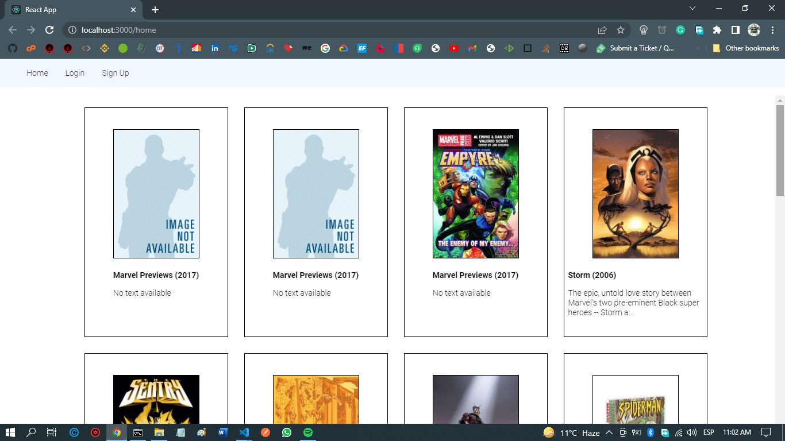
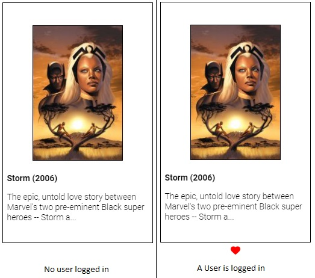
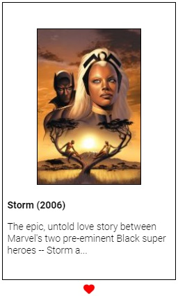
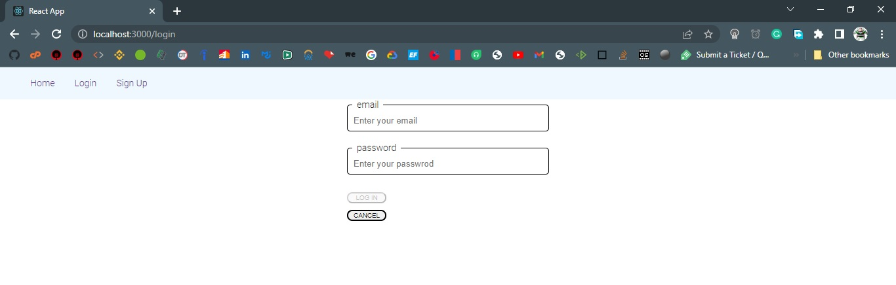
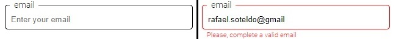
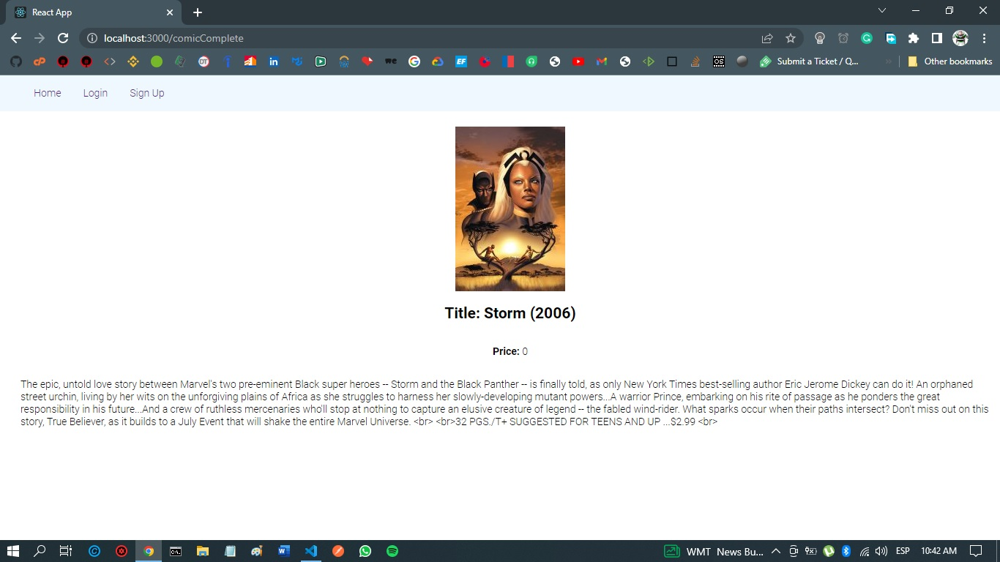
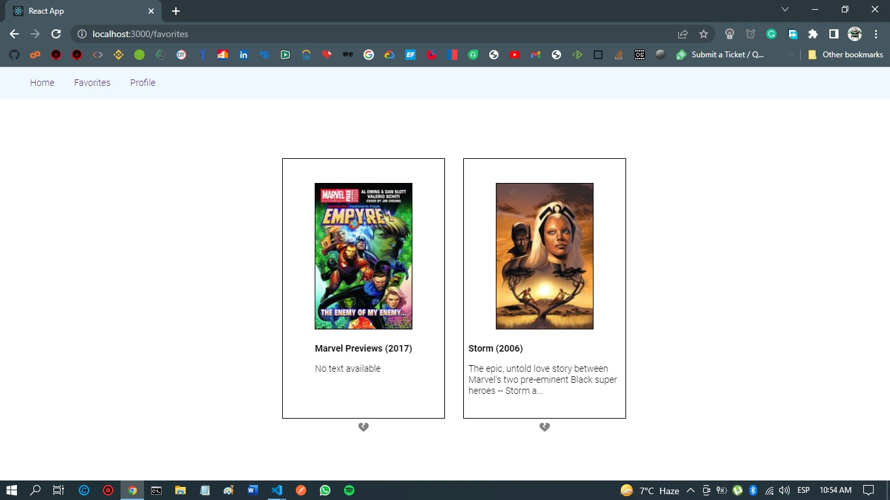
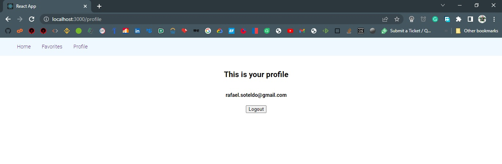

# **Marvel**



This app consumes the Marvel API and allows users to select their favorite marvel comics

Its main technologies are React, React-Redux, Styled-Components, React Router DOM, Axios.

The main folder is src, which contains most of the components that make up the app.

The files will be explained as they appear in the project

The default page is Home, which issues a useEffect [ ] that fetchs the comics data from the API and sets it to the redux state.

The favorites will be loaded from mongoDB when the user logs in.

The present document will highlight the most important features of the code, leaving out the details

## **The src folder**

The sub-folders are:

-  **components**
-  **globals**
-  **pages**
-  **redux**

## **components**

## - <ins>/src/components/ComicCard.js</ins>



This component is used by the Home page to display each comic card in a grid, using array map:

```jsx
// Home.js
comics.map((comicInfo, ndx) => {
   return (
      <ComicCard
         callFromFavorites={false}
         comicObject={comicInfo}
         index={ndx}
      />
   );
});
```

The icon is shown depending on the procedure `isFavorite`:

```jsx
// It receives the comicObject of the clicked comic, and looks over favoritesComics for this particular object
const isFavorite = (favoriteComics, comicObject) => {
   let isFavorite = false;
   if (favoriteComics.length > 0) {
      favoriteComics.forEach((favoriteComic) => {
         if (parseInt(favoriteComic.comicId) === comicObject.comicId) {
            isFavorite = true;
         }
      });
   }
   return isFavorite;
};

...

{
   user && !callFromFavorites && (
      <ShowIcon
         heartIsRed={isFavorite(favoriteComics, comicObject)}
         isFavorite={callFromFavorites}
         icon={
            callFromFavorites
               ? faHeartCrack
               : isFavorite(favoriteComics, comicObject)
               ? solidHeart
               : regularHeart
         }
         onClick={(e) => handleHeartClick(comicObject, e)}
      />
   );
}
```

If the user clicks on a hollow heart, the comic is added to the favorites, and a solid heart is shown.



If the user clicks on a solid heart, the comic is removed from the favorites, and a hollow heart is shown again (unfavorite the comic).

If the call to this component is from Favorites, it displays a craked icon:


The cracked heart is a button that's used to unfavorite a comic.

## - <ins>/src/components/LoginSignUp.js</ins>



This component is used when the user select in the menu bar, both, login or signup, we can appreciate in App.js the following:

```jsx
// App.js
<Route
   path="/signup"
   element={<LoginSignUp isSignUp={true} />}
/>
<Route
   path="/login"
   element={<LoginSignUp isSignUp={false} />}
/>
```

When the component starts, it issues a useEffect [ ] that loads all registered users.

The user id (\_id) is also saved along each favorite comic database object, which will allow us to identify a user's favorite comic

This component uses the hook useAuth, which exports all relevant actions to be performed about users, one of those is loadUsers:

```jsx
import { useAuth } from "../globals/auth";

...

const auth = useAuth();

...
useEffect(() => {
   const res = axios.get("http://localhost:3001/v1/users").then((res) => {
      auth.loadUsers(res.data);
   });
}, []);
```

This request reads all users already registered in the mongoDb Atlas DB ("Get All users, marvel back" ).

It contains a controlled form that gets the email and password, the login button (which can be "Sign Up" when isSignUp is true) is activated once both fields are filled in with correct values.

### - Some inner details of the form

The correct value for an email is a correct email address, and for the password, it's at least 8 characters long, at least a number and a letter from the alphabet.

The form valiudates its fields using the following regular expressions:

```jsx
const emailRE = /^[a-zA-Z0-9_.+-]+@[a-zA-Z0-9-]+\.[a-zA-Z0-9-.]+$/u;
const passwordRE = /^(?=.*[A-Za-z])(?=.*\d)[A-Za-z\d]{8,}$/u;
```

It uses a `touched` array, which serves to indicate whether fields has a value or not.

### - Defining a field in the form

This is an inputField when there's an error:



```jsx
const FieldContainer = styled.div``;

// An inputField is defined upon the fieldset, and overwrites:
//    border: (making it red when there's an error)
//    legend
//    Input: making it wide enough, disabling the border, disabling it's outline when focused
// among other things
// EXAMPLE
const InputField = styled.fieldset`
   border: 1px solid ${({ error }) => (error ? "red" : "black")};
   border-radius: 5px;
   padding: 0.5em;
   margin: 0 0;
   width: 22em;

   legend {
      padding: 0 7px;
      color: black;
   }

   Input {
      color: black;
      border: none;
      width: 100%;
      :focus {
         outline: none;
      }
   }
`;

const Input = styled.input``;

const FieldErrorText = styled.label`
   margin: 0.7em;
   padding: 0;
   color: red;
   font-size: 0.8em;
`;

...

<FieldContainer>
   <InputField
      error={touched[email] && errorMessagesRefValues.current.email !== ""}
   >
      <legend>email</legend>
      <Input
         type="text"
         name={email}
         size="50"
         placeholder="Enter your email"
         value={formValues.email}
         onChange={handleInputChange}
      />
   </InputField>
   <FieldErrorText>
      {touched[email] && errorMessagesRefValues.current.email}
   </FieldErrorText>
</FieldContainer>
```

I declared the error messages array as a ref, so that it updates inmediately, not asynchorously as a standard state variable, this way, the error messages are always up to date

Note that an empty value is not an error, it just sets the corresponding touched value to false, making the login/sign up button disabled

### - Enabling or disabling the Login/Sign Up button:

```jsx
useEffect(
   () => {
      let fieldValidations = [];
      // get an array of all the values of the fields that have values
      Object.keys(touched).forEach((field) => {
         fieldValidations.push({ field, valid: validateField(field) });
      });

      // check if a required field has an incorrect value
      setDisableSendButton(
         fieldValidations.some((fieldValidations) => {
            return (
               requiredFields[fieldValidations.field] && !fieldValidations.valid
            );
         })
      );
   },
   // eslint-disable-next-line react-hooks/exhaustive-deps
   [formValues]
);
```

If one of the formvalues changes, then this code is executed. Then, if at least one of the fields have an incorrect value, the button is disabled, and, if all the fields have a correct value, the button is enabled by setting the disableSendButton to false.

The way to make it enabled or disabled is by associating the value of the state variable disableSendButton to the disabled property of the button.

```jsx
<ThisButton disabled={disableSendButton} onClick={performOk}>
   {isSignUp ? "SIGN UP" : "LOG IN"}
</ThisButton>
```

The styled component `<ThisButton/>` is derived from globalStyles.Button:

```jsx
const ThisButton = styled(globalStyles.Button)`
   margin-top: 10px;
   width: 60px;
`;
```

And globalStyles.Button is:

```jsx
// globalStyles.js
// if the disable argument is true, then the button is disabled
export const Button = styled.button`
   ${({ disabled }) =>
      disabled &&
      `
            disabled
        `}
   with: 30px;
   border-radius: 8px;
   &:hover {
      background-color: ${({ disabled }) => (disabled ? null : "lightgray")};
   }
   &:active {
      background-color: "lightgray";
      color: "black";
   }
   font-size: 0.7em;
`;
```

And, as you see, there are settings for hover, active, etc..

### PerformOk

This procedure checks whether the user is registered or not, and if not, it suggests the user to register.

If the user is registered, it checks whether the entered password is equal to the one saved in the database.

## - <ins>/src/components/NavBar.js</ins>

It is in charge of showing the main navigation menu

When no user is logged in, the options are Home, Login and Sign Up.

When a user is logged in, the options are Home, Favorites and Profile.

The way I show or not some options is by using an argument in styled components:

```jsx
export const NavElementShowWhenLoggedIn = styled(NavLink)`
   ${NavItem}
   display: ${({ logged }) => (logged ? "inline" : "none")};
`;
```

In this case, ${NavItem} is the default css options for any menu item:

```jsx
const NavItem = css`
   margin-left: 1em;
   cursor: pointer;
   text-decoration: none;
`;
```

Then for the display options, I ask for logged, which tells me if a user is logged in or not:

```jsx
<NavElementShowWhenLoggedIn logged={isLoggedIn} to="/favorites">
   Favorites
</NavElementShowWhenLoggedIn>
```

The element `<NavElementNoShowWhenLoggedIn />` is the opposite

The way isLoggedIn is set is:

```jsx
useEffect(() => {
   setIsLoggedIn(auth.user === null ? false : true);
}, [auth.user]);
```

This way, if auth.user changes, the validation is done again.

## **globals**

The folder **globals** contains the code that delivers global features to the application, such as the global styles and the auth hook.

## - <ins>/src/globals/auth.js</ins>

This works as a hook that delivers to all other elements the information and actions about the user, such as, is the user logged in or not, login, sign up, logout, etc.

As all hooks, it is used as a context provider, so, it encloses the rest of the application:

```jsx
// App.js
<AuthProvider>
   <GlobalStyles />
   <Navbar />
   <Routes>
      <Route path="/" element={<Navigate to="/home" />} />
      ...
   </Routes>
</AuthProvider>
```

```jsx

const AuthContext = createContext(null);

export const AuthProvider = ({ children }) => {
   ...
   const loadUsers = (usersPayload) => {
      setUsers([...usersPayload]);
   };
   ...
   const logout = () => {
      setUser(null);
   };
   return (
      <AuthContext.Provider
         value={{
            loadUsers,
            ...
         }}
      >
         {children}
      </AuthContext.Provider>
   );
};
export const useAuth = () => {
   return useContext(AuthContext);
};

```

It first defines the context that will be used.

Then defines the AuthProvider itself, which defines the state variables (user, setUser, etc.), the actions (loadUsers, registerNewUserAndLogin, logoin, logout, etc.) and the context provider.

## - <ins>/src/globals/globalStyles.js</ins>

It defines the global theme that will be used by styled components

It also defines the global styles that will be applied to the whole user interface:

```jsx
export const GlobalStyles = createGlobalStyle`
    html, body {
        margin: 0;
        padding: 0;
    }
    *, *::after, *::before {
        box-sizing: border-box;
    }
    body {
        color: 'black';
        font-family: "Roboto";
        font-size: 14px;
    }
    nav {
        background-color: aliceblue;
        padding: 16px 32px;
    }

    nav a {
        margin-right: 16px;
    }
`;
```

These styles are applied to the wholñe application in App.js:

```jsx
// App.js
<AuthProvider>
   <GlobalStyles /> // <===
   <Navbar />
   <Routes>
      <Route path="/" element={<Navigate to="/home" />} />
      ...
   </Routes>
</AuthProvider>
```

And the general Button, that all buttons in the app will be based on:

```jsx
export const Button = styled.button`
   ${({ disabled }) =>
      disabled &&
      `
            disabled
        `}
   with: 30px;
   border-radius: 8px;
   &:hover {
      background-color: ${({ disabled }) => (disabled ? null : "lightgray")};
   }
   &:active {
      background-color: "lightgray";
      color: "black";
   }
   font-size: 0.7em;
`;
```

If the argument disabled is true, then the button is disabled.

The hover changes the buttons background color to lightgray.

The active changes the buttons background color to lightgray and changes the text color to black.

Etc...

## **Pages**

It includes all the pages that will be referred by the react router dom

## - <ins>/src/pages/ComicComplete.js</ins>

It simply shows in a page the comic that the user has clicked on, be it from Home or from Favorites.



## - <ins>/src/pages/Favorites.js</ins>

It shows the comics that have been marked as favorites by the user.



It simply iterates through the global variable favoriteComics, and invokes the component `<ComicCard/>` for each of them.

```jsx
{
   favoriteComics.map((comicInfo, ndx) => {
      return (
         <ComicCard
            callFromFavorites={true}
            comicObject={comicInfo}
            index={ndx}
         />
      );
   });
}
```

## - <ins>/src/pages/Home.js</ins>

This is the main page, it shows all comic cards

The way the user marks a comic as a favorite is by clicking the heart that appears under each comic in the home page:


Once the user clicks on a hollow heart, it becomes solid indicating that the user has marked it as a favorite, then the procedure `handleHeartClick` will decide whether to add or remove the comic from the favorites list.

```jsx
const handleHeartClick = (comicObj, e) => {
   if (user) {
      if (isFavorite(favoriteComics, comicObj)) {
         deleteFavoriteComicLocal(user._id, comicObj.comicId);
      } else {
         addFavoriteComicLocal(user._id, comicObj);
      }
   }
};
```

`deleteFavoriteComicLocal()` and `addFavoriteComicLocal()` are just local versions of the corresponding redux actions `deleteFavoriteComic()` and `addFavoriteComic()`.

```jsx
function mapStateToProps(state) {
   return {
      comics: state.comicsReducer.comics,
      comicsLoaded: state.comicsReducer.comicsLoaded,
   };
}

function mapDispatchToProps(dispatch) {
   return {
      getComicsLocal: () => {
         return dispatch(getAllComics());
      },
      getAllFavoriteComicsLocal: (userId) => {
         return dispatch(getAllFavoriteComics(userId));
      },
   };
}

export default connect(mapStateToProps, mapDispatchToProps)(Home);
```

## - <ins>/src/pages/Profile.js</ins>

It simply shows the users email, and a button to allow logging out



## - **Redux**

Redux allows us to make available to the entire application, a state.

In this app we have two redux states, the comics state and the favoriteComics state.

Then comics state holds all the comics, and favoriteComics state holds the comics that the user has marked as favorites.

The reason for not having a users state is that this application doesn't include a users administration, so I decided to manage users just as a context (`authContext`), besides, there won't be many users as there are comics.

## - **Actions folder**

It contains all the action creators for both the comics reducer and the favoriteComics reducer.

## - <ins>src\redux\actions\comicsActions.js</ins>

It defines all actions creators related to the comics state, in this case, the more important one is the getAllComics action, which is used to get all the comics from the server.

```jsx
// env.MARVEL_APIKEY and env.MARVEL_HASH are my keys of the marvel api
export function getAllComics() {
   return (dispatch) => {
      ...
      dispatch(getComicsBegin);
      let apiUrl = `https://gateway.marvel.com/v1/public/comics?ts=1&apikey=${env.MARVEL_APIKEY}&hash=${env.MARVEL_HASH}`;
      axios
         .get(apiUrl)
         .then((res) => {
            res.data.data.results.forEach((comic) => {
               newDataObject.push({
                  comicId: comic.id,
                  ...
               });
            });

            dispatch(getComicsSuccess(newDataObject));
         })
         .catch((error) => {
            dispatch(getComicsFailure(error));
         });
   };
}
```

As you can see, there are other actions creator:

-  getComicsBegin
-  getComicsSuccess (This actions actually puts the data in the state as state.comicsReducer.comics)
-  getComicsFailure

These action creators are used to dispatch the actions to the reducer.

## - <ins>src\redux\actions\favoriteComicsActions.js</ins>

It exposes the main action creators for the favoriteComics reducer.

The main are:

-  getAllFavoriteComics
-  addFavoriteComic
-  deleteFavoriteComic

The names are self explanatory.

## - **Reducers folder**

It contains all reducers used in the app, they are:

-  comicsReducer
-  favoriteComicsReducer
-  rootreducer, it just combines the previous reducers into one

## - <ins>src\redux\reducers\comicsReducer.js</ins>

Performs all actions related to the comics state, that are related to an specific action creator.

The main purpose of these actions is to have the data of all the comics that come from the marvel api into the comics state.

## - <ins>src\redux\reducers\favoriteComicsReducer.js</ins>

Performs all actions related to the favorite comics state.

The main purpose of these actions is to have the data of all the favorite comics that come from the mongoDb database, related to the logged in user, into the favopriteComics state.

## - **Stores folder**

Here is where the store is configured.

The thunk middleware is used so we can write actions creators using the dispatch method.

redux-devtools-extension is also included, which allows us to watch the state changes in the browser.

## **App.js**

The purpose of this component is to ensamble many of the pieces toguether:

```jsx
<Provider store={configStore}>
   // This provider makes the redux state available to all the components
   <ThemeProvider theme={globalTheme}>
      // This ThemeProvider makes the global theme for styled components
      <AuthProvider>
         // The AuthProvider makes the authContext available to all the
         components
         <GlobalStyles />
         // The GlobalStyles component is used to apply the global styles
         <Navbar />
         // The Navbar component is used to display the navbar
         <Routes>
            // Here we indicate where the links from the navbar are actually
            going to
            <Route path="/" element={<Navigate to="/home" />} />
            ...
         </Routes>
      </AuthProvider>
   </ThemeProvider>
</Provider>
```

## **index.js**

```jsx
ReactDOM.render(
   <React.StrictMode>
      <BrowserRouter>
         // This router makes the pushState, replaceState and the popstate
         events available to the application. They come from HTML 5 history api
         <App />
         // The whole app that will be rendered
      </BrowserRouter>
   </React.StrictMode>,
   document.getElementById("root") // The root element of the app where the app will be rendered
);
```

## **package.json.js**

Among other things, it contains all the dependencies that will be installed in the project with the "npm install" command.
