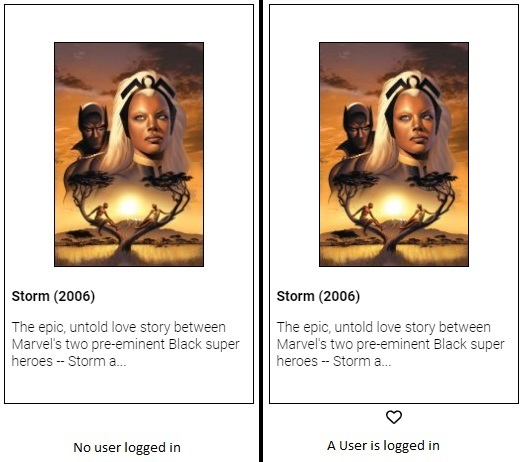
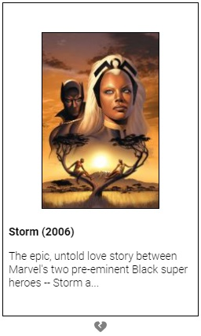

[](https://github.com/rafaelsoteldosilva/marvel-front/blob/main/README.es-cl.md)

# **Marvel**

<p align="center">
     
</p>
 
This app consumes the Marvel API and allows users to select their favorite marvel comics

Its main technologies are

-  React,
-  React-Redux,
-  Styled-Components,
-  React Router DOM,
-  Axios.

## **Installation guide**

-  GIT clone the repository in your hard drive
-  cd into the created directory, and run `npm install` which will install all needed dependencies
-  Get an APIKEY and a HASH from the Marvel portal for developers: https://developer.marvel.com/. Just subscribe and follow the instructions

<p align="center">
  
</p>

-  Create an .env file in the root directory, and place there the obtained values:

```
MARVEL_APIKEY=<your api key>
MARVEL_HASH=<your hash number>
```

These values will be used in the function `getAllComics` in `src/redux/actions/comicsActions.js`

-  Run marvel-server, in order to have the server listening to the port 3001
-  Run the app with `npm start`

## **The Project**

The main folder is **src**, which contains most of the components that make up the app.

The files will be explained in the same order as they appear in the project in `VS Code`

The default page is Home, which issues a `useEffect [ ]` that fetchs the comics data from the Marvel API and sets it to the redux state.

```jsx
// src/pages/Home.js
...
useEffect(() => {
   getComicsLocal();
}, []);
...
```

The favorites will be loaded from MongoDB (see `Marvel Server`) when the user logs in:

```jsx
// src/pages/Home.js
...
useEffect(() => {
   if (auth.user) {
      getAllFavoriteComicsLocal(auth.user._id);
   }
}, [auth.user]);
...
```

The present document will highlight the most important features of the app, leaving out the details.

## **The src folder**

The sub-folders are:

-  **components**
-  **globals**
-  **pages**
-  **redux**

## **components**

### - **<ins>/src/components/ComicCard.js</ins>**

<p align="center">
  
</p>

This component is used by `Home.js` y `Favorites.js` to display each comic card in a grid, be it the comics from the API or the favorites:

```jsx
// src/pages/Home.js
comics.map((comicInfo, ndx) => {
   return (
      <ComicCard
         callFromFavorites={false}
         comicObject={comicInfo}
         index={ndx}
      />
   );
});
```

```jsx
// src/components/ComicCard.js
// In order to know if a comicObject is a favorite one
...
   const isfavorite = (favoriteComics, comicObject) => {
      let isFavorite = false;
      if (favoriteComics.length > 0) {
         isFavorite = favoriteComics.some(
            (favoriteComic) =>
               parseInt(favoriteComic.comicId) === comicObject.comicId
         );
      }
      return isFavorite;
   };

...

// The icon is shown depending on the procedure `isFavorite`

...
user && !callFromFavorites && (
   <ShowIcon
      heartIsRed={isFavorite(favoriteComics, comicObject)}
      isFavorite={callFromFavorites}
      icon={
         callFromFavorites
            ? faHeartCrack
            : isFavorite(favoriteComics, comicObject)
            ? solidHeart
            : regularHeart
      }
      onClick={(e) => handleHeartClick(comicObject, e)}
   />
);
...
```

If the user clicks on a hollow heart, the comic is added to the favorites, and a solid heart is shown.

<p align="center">
  
</p>

If the user clicks on a solid heart, the comic is removed from the favorites, and a hollow heart is shown again.

If the call to this component is from `Favorites.js`, it displays a craked icon, which means that the comic can be removed from the list of favorites

<p align="center">
  
</p>

### - **<ins>/src/components/LoginSignUp.js</ins>**

<p align="center">
  
</p>

This component is used when the user selects from the menu bar, both, login or signup.

It can be appreciated in `App.js`:

```jsx
// App.js
<Route
   path="/signup"
   element={<LoginSignUp isSignUp={true} />}
/>
<Route
   path="/login"
   element={<LoginSignUp isSignUp={false} />}
/>
```

```jsx
// src/components/LoginSignUp.js
import { useAuth } from "../globals/auth";

...

const auth = useAuth();

...
   useEffect(() => {
      const res = axios
         .get("http://localhost:3001/v1/users/getAllusers")
         .then((res) => {
            auth.loadUsers(res.data);
         });
   }, []);
```

It will invoke the endpoint:

```jsx
// marvel-server/routes/usersRoutes.js
router.route("/getAllUsers").get(UserEndpoints.getAllUsers);
```

This request reads all users already registered in the mongo Atlas database.

It contains a controlled form that gets the email and password, the `login` button (which can be `Sign Up` when `isSignUp` is `true`) is activated once both fields are filled in with correct values.

### - **Some inner details of the form**

The correct value for an email is a correct email address, and for the password, it's at least 8 characters long, at least a number and a letter from the alphabet.

The form validates its fields using the following `regular expressions`:

```jsx
const emailRE = /^[a-zA-Z0-9_.+-]+@[a-zA-Z0-9-]+\.[a-zA-Z0-9-.]+$/u;
const passwordRE = /^(?=.*[A-Za-z])(?=.*\d)[A-Za-z\d]{8,}$/u;
```

The form also uses a `touched` array, which serves to indicate whether the fields have a value or not.

### - **Defining a field in the form**

This is an inputField:


I define each field as:

```jsx
// src/components/LoginSignUp.js
<FieldContainer>
   <InputField
      error={touched[email] && errorMessagesRefValues.current.email !== ""}
   >
      <legend>email</legend>
      <Input
         type="text"
         name={email}
         size="50"
         placeholder="Enter your email"
         value={formValues.email}
         onChange={handleInputChange}
      />
   </InputField>
   <FieldErrorText>
      {touched[email] && errorMessagesRefValues.current.email}
   </FieldErrorText>
</FieldContainer>
```

Note that I specify the legend and the input for each field, these elements are styled as:

```jsx
// src/components/LoginSignUp.js
const FieldContainer = styled.div``;

// An inputField is defined upon the fieldset
// I then overwrite the style of the fieldset
//    border: (making it red when there's an error)
//    legend
//    Input: making it wide enough, disabling the border, disabling it's outline when focused
// among other things

// The input inside this fieldset is a regular input

// The reason I decided to "inherit" from fieldset and not input was to get the appearance of a fieldset, which
// is more compact

// FieldErrorText is the red text that appears bellow an input field when there's an error

// EXAMPLE
const InputField = styled.fieldset`
   border: 1px solid ${({ error }) => (error ? "red" : "black")};
   border-radius: 5px;
   padding: 0.5em;
   margin: 0 0;
   width: 22em;

   legend {
      padding: 0 7px;
      color: black;
   }

   Input {
      color: black;
      border: none;
      width: 100%;
      :focus {
         outline: none;
      }
   }
`;

const Input = styled.input``;

const FieldErrorText = styled.label`
   margin: 0.7em;
   padding: 0;
   color: red;
   font-size: 0.8em;
`;
```

I declared the error messages array as a `ref` array, so that it updates inmediately on setting, not asynchorously as a standard state variable, this way, the error messages are always up to date. I also declared a dummy state variable `forceRender`, that I set every time I change the error messages array, so that a render of the component is forced

Note that an empty field is not an error, it just sets the corresponding touched value to `false`, making the login/sign up button disabled.

### - **Enabling or disabling the Login/Sign Up button**

```jsx
// src/components/LoginSignUp.js
useEffect(
   () => {
      let fieldValidations = [];
      // get an array of all the values of the fields that are not empty and correctly filled
      Object.keys(touched).forEach((field) => {
         fieldValidations.push({ field, valid: validateField(field) });
      });

      // check if a required field has an incorrect value
      setDisableSendButton(
         fieldValidations.some((fieldValidations) => {
            return (
               requiredFields[fieldValidations.field] && !fieldValidations.valid
            );
         })
      );
   },
   // eslint-disable-next-line react-hooks/exhaustive-deps
   [formValues]
);
```

If one of the form values changes the previous code is executed. Then, if at least one of the fields have an incorrect value, the button is disabled, and, if all the fields have a correct value instead, the button is enabled, by setting the `disableSendButton` to `false`.

The way to make it enabled or disabled is by associating the value of the state variable `disableSendButton` to the disabled property of the button.

```jsx
// src/components/LoginSignUp.js
<ThisButton disabled={disableSendButton} onClick={performOk}>
   {isSignUp ? "SIGN UP" : "LOG IN"}
</ThisButton>
```

The styled component `<ThisButton />` is derived from `globalStyles.Button`:

```jsx
// src/components/LoginSignUp.js
const ThisButton = styled(globalStyles.Button)`
   margin-top: 10px;
   width: 60px;
`;
```

And `globalStyles.Button` is:

```jsx
// globalStyles.js
// if the disable argument is true, then the button is disabled
export const Button = styled.button`
   ${({ disabled }) =>
      disabled &&
      `
            disabled
        `}
...
```

### **PerformOk**

This procedure checks whether the user is registered or not, and if not, it suggests the user to register.

If the user is registered, it checks whether the entered password is equal to the one saved in the database.

```jsx
// src/components/LoginSignUp.js
...
const LoginSignUp = ({ isSignUp, getAllFavoriteComicsLocal }) => {
   const auth = useAuth();
   const navigate = useNavigate();

...

const performOk = () => {
   if (isSignUp) {
      if (auth.isARegisteredUser(formValues.email)) {
         alert(
            `${formValues.email} ya es un usuario registrado, por favor, haga LogIn`
         );
         navigate("/");
      } else {
         createUser({
            email: formValues.email,
            password: formValues.password,
         });
         navigate("/");
      }
   } else {
      if (auth.checkUserPassword(formValues.email, formValues.password)) {
         auth.login(formValues.email);

         navigate("/");
      } else {
         alert(
            `${formValues.email} no está registrado o no coindide el password`
         );
         navigate("/");
      }
   }
   navigate("/");
};
```

### - **<ins>/src/components/NavBar.js</ins>**

It is in charge of showing the main navigation menu

When no user is logged in, the options are Home, Login and Sign Up.

When a user is logged in, the options are Home, Favorites and Profile.

The way I show or not some options is by using an argument in styled components:

```jsx
// src/components/NavBar.js
export const NavElementShowWhenLoggedIn = styled(NavLink)`
   ${NavItem}
   display: ${({ logged }) => (logged ? "inline" : "none")};
`;
```

`${NavItem}` are the default css options for any menu item:

```jsx
// src/components/NavBar.js
const NavItem = css`
   margin-left: 1em;
   cursor: pointer;
   text-decoration: none;
`;
```

Then for the display options, I ask for logged, which tells me if a user is logged in or not:

```jsx
// src/components/NavBar.js
<NavElementShowWhenLoggedIn logged={isLoggedIn} to="/favorites">
   Favorites
</NavElementShowWhenLoggedIn>
```

The element `<NavElementNoShowWhenLoggedIn />` is the opposite

The way `isLoggedIn` is set is:

```jsx
// src/components/NavBar.js
useEffect(() => {
   setIsLoggedIn(auth.user === null ? false : true);
}, [auth.user]);
```

This way, if auth.user changes, the validation is done again.

## **globals**

The folder **globals** contains the code that delivers global features to the application, such as the global styles and the `auth` hook.

### - **<ins>/src/globals/auth.js</ins>**

This works as a hook that delivers to all other elements the information and actions about the user, such as, is the user logged in or not, the login function, sign up, logout, etc.

As all hooks, it is used as a context provider:

```jsx
// App.js
<AuthProvider>
   <GlobalStyles />
   <Navbar />
   <Routes>
      <Route path="/" element={<Navigate to="/home" />} />
      ...
   </Routes>
</AuthProvider>
```

```jsx
// src/globals/auth.js
const AuthContext = createContext(null);

export const AuthProvider = ({ children }) => {
   ...
   const loadUsers = (usersPayload) => {
      setUsers([...usersPayload]);
   };
   ...
   const logout = () => {
      setUser(null);
   };
   return (
      <AuthContext.Provider
         value={{
            loadUsers,
            ...
         }}
      >
         {children}
      </AuthContext.Provider>
   );
};
export const useAuth = () => {
   return useContext(AuthContext);
};

```

It first defines the context that will be used.

Then defines the `AuthProvider` itself, which defines the state variables (user, setUser, etc.), the actions (loadUsers, registerNewUserAndLogin, logoin, logout, etc.) and the context provider.

### - **<ins>/src/globals/globalStyles.js</ins>**

It defines the global theme that will be used by styled components

It also defines the global styles that will be applied to the whole user interface:

```jsx
// src/globals/globalStyles.js
export const GlobalStyles = createGlobalStyle`
    html, body {
        margin: 0;
        padding: 0;
    }
    *, *::after, *::before {
        box-sizing: border-box;
    }
    body {
        color: 'black';
        font-family: "Roboto";
        font-size: 14px;
    }
    nav {
        background-color: aliceblue;
        padding: 16px 32px;
    }

    nav a {
        margin-right: 16px;
    }
`;
```

These styles are applied to the whole application in App.js:

```jsx
// App.js
<AuthProvider>
   <GlobalStyles /> // <===
   <Navbar />
   <Routes>
      <Route path="/" element={<Navigate to="/home" />} />
      ...
   </Routes>
</AuthProvider>
```

I also defines the general Button, which all buttons in the app will be based on:

```jsx
// src/globals/globalStyles.js
export const Button = styled.button`
   ${({ disabled }) =>
      disabled &&
      `
            disabled
        `}
   with: 30px;
   border-radius: 8px;
   &:hover {
      background-color: ${({ disabled }) => (disabled ? null : "lightgray")};
   }
   &:active {
      background-color: "lightgray";
      color: "black";
   }
   font-size: 0.7em;
`;
```

If the argument `disabled` is `true`, then the button is disabled.

`&:hover` changes the buttons background color to `lightgray`.

`&:active` changes the button's background color to `lightgray` and changes the text color to `black`.

Etc..

## **Pages**

It includes all the pages that will be referred by the `React Router Dom`

### - **<ins>/src/pages/ComicComplete.js</ins>**

It simply shows in a page the comic that the user has clicked on, be it from Home or from Favorites.

<p align="center">
  
</p>

### - **<ins>/src/pages/Favorites.js</ins>**

It shows the comics that have been marked as favorites by the user.

<p align="center">
  
</p>

It simply iterates through the global variable `favoriteComics`, and invokes the component `<ComicCard />` for each one of them.

```jsx
{
   favoriteComics.map((comicInfo, ndx) => {
      return (
         <ComicCard
            callFromFavorites={true}
            comicObject={comicInfo}
            index={ndx}
         />
      );
   });
}
```

### - **<ins>/src/pages/Home.js</ins>**

This is the main and default page of the app, it shows all comic cards de la API

The way the user marks a comic as a favorite is by clicking the heart that appears under each comic in the `Home` page:

<p align="center">
  
</p>

Once the user clicks on a heart, then the procedure `handleHeartClick` will decide whether to add or remove the comic from the favorites list.

```jsx
const handleHeartClick = (comicObj, e) => {
   if (user) {
      if (isFavorite(favoriteComics, comicObj)) {
         deleteFavoriteComicLocal(user._id, comicObj.comicId);
      } else {
         addFavoriteComicLocal(user._id, comicObj);
      }
   }
};
```

If it was not favorite, the heart becomes solid, indicating that it's comic has been marked favorite, and the comic is added to the list of users's favorites (saving it to the DB as well).

If it was in the list, then the heart becomes hollow, and the corresponding comic is removed from the list.

`deleteFavoriteComicLocal()` and `addFavoriteComicLocal()` are just local versions of the corresponding redux actions `deleteFavoriteComic()` and `addFavoriteComic()`.

```jsx
function mapStateToProps(state) {
   return {
      comics: state.comicsReducer.comics,
      comicsLoaded: state.comicsReducer.comicsLoaded,
   };
}

function mapDispatchToProps(dispatch) {
   return {
      getComicsLocal: () => {
         return dispatch(getAllComics());
      },
      getAllFavoriteComicsLocal: (userId) => {
         return dispatch(getAllFavoriteComics(userId));
      },
   };
}

export default connect(mapStateToProps, mapDispatchToProps)(Home);
```

### - **<ins>/src/pages/Profile.js</ins>**

It simply shows the user's email, and a button to allow logging out

<p align="center">
  
</p>

## - **Redux**

`Redux` allows us to make certain information available to the entire application, a state.

In this app we have two redux states, the comics state and the favoriteComics state.

Then comics state holds all the comics from the api, and favoriteComics state holds the comics that the user has marked as favorites.

The reason for not having a redux users state also, is that this application doesn't include a users administration, so I decided to have the users just as a simple context (`authContext`), besides, there won't be many users as there are comics in the api.

### - **Actions folder**

It contains all the action creators for both the comics reducer and the favoriteComics reducer.

### - **<ins>src\redux\actions\comicsActions.js</ins>**

It defines all `actions creators` related to the comics redux state, in this case, the more important `action creator` one is the `getAllComics()`, which is used to get all the comics from the api.

```jsx
// env.MARVEL_APIKEY and env.MARVEL_HASH are my keys of the marvel api
export function getAllComics() {
   return (dispatch) => {
      ...
      dispatch(getComicsBegin);
      let apiUrl = `https://gateway.marvel.com/v1/public/comics?ts=1&apikey=${env.MARVEL_APIKEY}&hash=${env.MARVEL_HASH}`;
      axios
         .get(apiUrl)
         .then((res) => {
            res.data.data.results.forEach((comic) => {
               newDataObject.push({
                  comicId: comic.id,
                  ...
               });
            });

            dispatch(getComicsSuccess(newDataObject));
         })
         .catch((error) => {
            dispatch(getComicsFailure(error));
         });
   };
}
```

As you can see, there are other actions creator:

-  getComicsBegin
-  getComicsSuccess (This `action creator` indicates to the comic reducer to put the api data in comics state: state.comicsReducer.comics)
-  getComicsFailure

### - **<ins>src\redux\actions\favoriteComicsActions.js</ins>**

It exposes the main `action creators` for the favoriteComics reducer:

-  getAllFavoriteComics
-  addFavoriteComic
-  deleteFavoriteComic

The names are self explanatory.

### - **Reducers folder**

It contains all `reducers` used in `redux`:

-  comicsReducer
-  favoriteComicsReducer
-  rootreducer, it just combines the previous reducers into one

### - **<ins>src\redux\reducers\comicsReducer.js</ins>**

Performs all actions related to the comics state.

The main purpose of these actions is to have the data of all the comics from the marvel api into the comics state.

### - **<ins>src\redux\reducers\favoriteComicsReducer.js</ins>**

Performs all actions related to the favorite comics state.

The main purpose of these actions is to have the data of all the favorite comics that come from the mongoDb database, related to the logged in user, into the favopriteComics state.

### - **Stores folder**

Here is were the `redux store` is configured and created, in this case, a `thunk middleware` is included, so we have, among other things, the redux `dispatch` function. The `redux-devtools-extension` is also included

## **App.js**

The purpose of this component is to ensamble many of the pieces toguether:

```jsx
<Provider store={configStore}>
   // This provider makes the redux state available to all the components
   <ThemeProvider theme={globalTheme}>
      // This ThemeProvider makes the global theme for styled components
      <AuthProvider>
         // The AuthProvider makes the authContext available to all the
         components
         <GlobalStyles />
         // The GlobalStyles component is used to apply the global styles
         <Navbar />
         // The Navbar component is used to display the navbar
         <Routes>
            // Here we indicate where the links from the navbar are actually
            going to
            <Route path="/" element={<Navigate to="/home" />} />
            ...
         </Routes>
      </AuthProvider>
   </ThemeProvider>
</Provider>
```

## **index.js**

```jsx
ReactDOM.render(
   <React.StrictMode>
      <BrowserRouter>
         // This router makes the pushState, replaceState and the popstate
         events available to the application. They come from HTML 5 history api
         <App />
         // The whole app that will be rendered
      </BrowserRouter>
   </React.StrictMode>,
   document.getElementById("root") // The root element of the app where the app will be rendered
);
```
